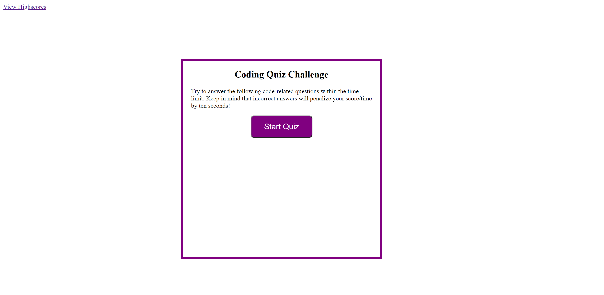
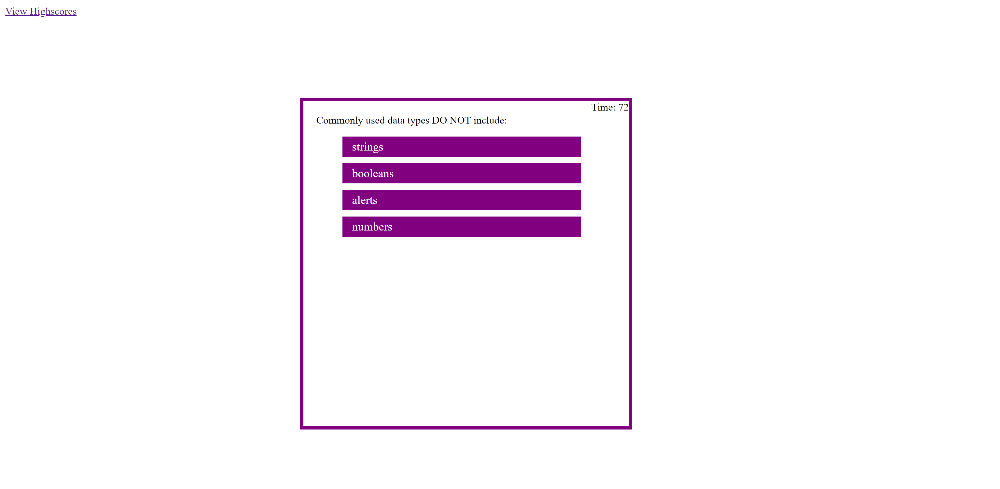
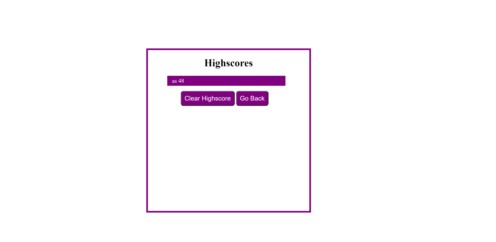

# Code-Quiz

This project was designed as a homework assignment or coding bootcamp. 

This is a quiz application built using HTML, CSS and JavaScript. The application presents a series of questions with four possible answers. Choosing the wrong answer deducts 10 seconds from the clock, the time you have left at the end of the quiz will be your score.

This project has been deployed to GitHub Pages. To get this project up and running, you can follow the deployment link. Or, download the sources files to use this as a template.

* [GitHub Repository](https://github.com/asidiki/code-quiz)
* [Deployed GitHub IO](https://asidiki.github.io/code-quiz/)

### Screenshots: 

**Homepage**

**Question Sample**

**Highscores page**

## Authors

* **Ansab Sidiki**
